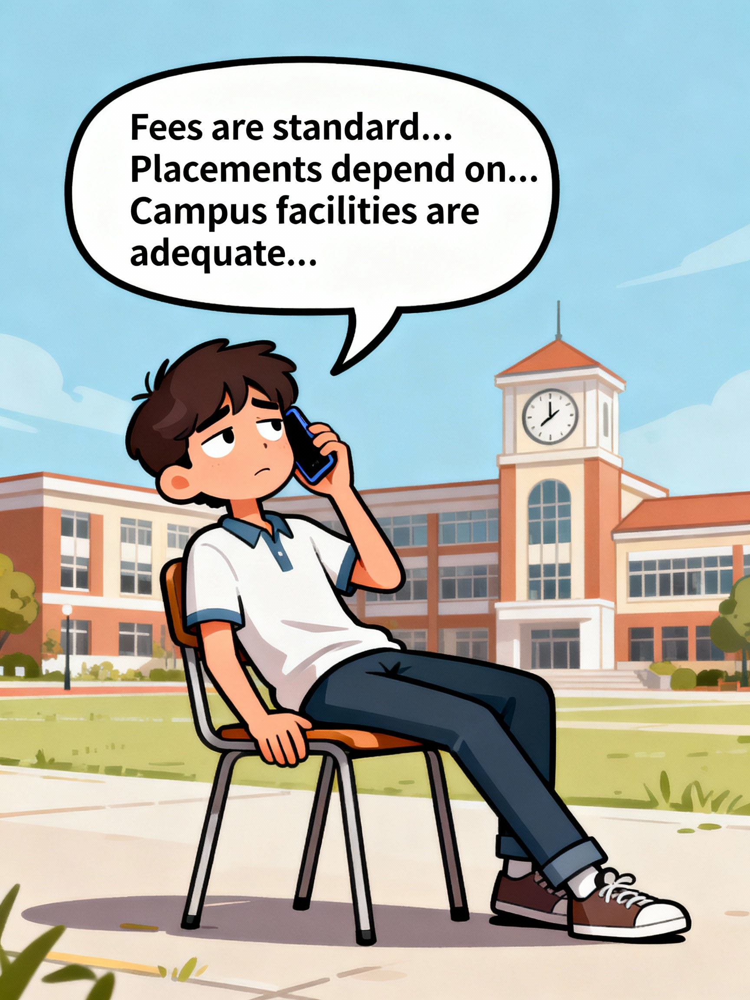

# 🤖 BillianceAI — Felina
## An Interactive AI Assistant - Just feel what you hear

Transforming college enquiry calls into immersive visual experiences.

---

## 🚀 Overview

Most AI calling agents today sound the same — voice-only, repetitive, and robotic.  
But students making admission enquiries don’t just want information — they want **clarity, trust, and visual understanding**.

**BillianceAI introduces a breakthrough:**  
An AI admission agent (**Felina**) that doesn’t just talk — it also make you to **feel the conversation.**

Felina sends a beautifully designed *visual admission deck* to the student's WhatsApp and walks them through it slide-by-slide during the call.

> 🎯 Turning cold enquiry calls into warm, guided visual journeys.

---

## 💭 How the Idea Started

<table>
<tr>
<td width="50%" align="center" valign="middle">

</td>
<td width="60%" valign="top">

A normal call goes like this:

1. Student: “What’s the fee?”
Felina: “Bla bla bla…”

2. Student: “What about placements?”
Felina: “Bla bla bla…”

3. Student: “How is the campus?”
Felina: “Bla bla bla…”

After a few questions, the call becomes monotonous.  
The information is correct — but **the experience is boring**.

Students get influence not just by answers, but by **presentation**.

That sparked the idea:

> ❓ Why should our AI hide behind voice?  
> 💡 Why not make it **visually interactive**?

</td>
</tr>
</table>

---

## 💡 The Spark — The Innovation

<table>
<tr>
<td width="50%" align="center" valign="middle">

</td>
<td width="60%" valign="top">

## Visual-Interactive AI Calling

**📽️ Felina - its time to influence**

- After endlessly replying
> **Felina:**  
> “Sir, I would like to walk you through the college visually. It takes just a few minutes sir!
> I’ve sent you a short brochure. Kindly open it, sir.” (Use earphones or phone speaker for better experince)

Student opens the PDF on WhatsApp.  
Felina becomes a **visual tour guide**.

Each page now becomes a talking point:
 
- Campus Photos  
- Departments & Facilities  
- Achievements   
- Placement Records 
- Fee Structure 
- Counselling Code  

This creates an **engaging, memorable, premium experience**.

</td>
</tr>
</table>

---

## ✨ Key Features

<table>
<tr>
<td width="50%" align="center" valign="middle">

</td>
<td width="60%" valign="top">

### 🎙️ Voice + Visual Hybrid Communication
Felina uses both voice explanation and real-time visual support.

### 📄 Auto-Generated Admission Deck
Dynamic PDF containing:

- Campus visuals  
- Placement graphs  
- Clubs, labs, and amenities  
- Accreditation & rankings  
- Fee breakdown  

### 📱 WhatsApp Integration
Admission deck delivered instantly through WhatsApp.

### 🧩 Personalized Walkthrough
Tailored visuals based on student's interest:

- Engineering → Labs, workshops  
- Management → Placement stats  
- Arts → Clubs, culture 
- Sports → Cricket, Volleyball

### 🤖 Smart Conversational Flow
Felina detects confusion, interest level, and objection patterns.

</td>
</tr>
</table>

---

## 🎬 Experience Flow

Student Call
→ Initial Questions
→ Felina Sends PDF
→ Visual Walkthrough
→ Personalized Pitch
→ Final Counselling Code
→ Lead Follow-up

---

## 🎯 Benefits

- 🌟 **Increased Engagement** — Students stay hooked through visuals  
- 📈 **Higher Conversion Rates** — Visual storytelling builds trust  
- 🎓 **Stronger College Branding** — Premium, professional experience  
- 📱 **Zero Friction** — No app needed  
- 🤖 **AI Consistency** — Every student gets the same high-quality guidance  

---

<table>
<tr>
<td width="50%" align="center" valign="middle">

</td>
<td width="60%" valign="top">

## 👥 Target Audience

- Colleges & Universities  
- Schools & Coaching Institutes  
- Education Consultants  
- EdTech Platforms  

---

## 📊 Market Opportunity

- 70% of people enquiries in India happen via **phone + WhatsApp**  
- Visual content influence decison  
- No major competitor offers **visual walkthrough calling**  
- Strong shift toward AI-powered admission workflows  

</td>
</tr>
</table>

---

<table>
<tr>
<td width="50%" align="center" valign="middle">

</td>
<td width="60%" valign="top">

## 🚀 Future Scope

### 📽️ VR Explanation 
- Demo classroom experience
- Demo lab experience etc

---

## 💰 Concept Diversification

- College 
- Property
- Electronics
- Bikes 
- Voice demo on products like gadgets 
- Personal doubt clarrification Teacher 
- so on....

</td>
</tr>
</table>

---

## 🧭 Why This Matters

BillianceAI shifts admission experience from:

> ✨ Boring voice conversations into Rich, interactive, visual guidance  

Students make decisions through **experience, clarity, and emotional connection** — not just words.

Felina delivers exactly that.

---

## 👁️ Research proof

[Link](https://github.com/Raguram-N/BillianceAI-1-proof/blob/main/README.md)

---

## 🏁 Conclusion

**BillianceAI transforms admission calls into visual storytelling moments.**  
By combining voice intelligence with visual engagement, Felina becomes a powerful admission partner — not just an answering bot.

> ✨ _“Admissions are won through experiences — we made those experiences smarter.”_

